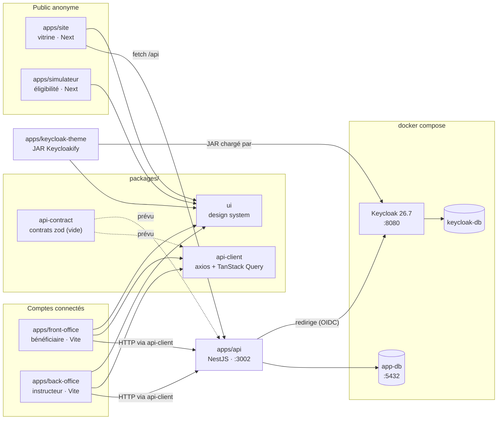

# Cartographie des apps et packages — ETAPE

Ce document dit **quel workspace sert à quoi, pour qui, et où faire quoi**. Il s'adresse aux humains comme aux agents : chaque workspace porte un `AGENTS.md` (importé par son `CLAUDE.md`) qui en reprend l'essentiel et renvoie ici.

Tenu à jour par `npm run check:workspace-map`, vérifié en CI : un workspace absent de ce document, ou sans fichier d'agent, fait échouer la PR.

## 1. Vue d'ensemble



Flèche pleine : dépendance ou appel réel. Pointillés : prévu, pas encore en place.

## 2. Les workspaces

| Workspace                  | Rôle                                                                      | Public                         | Stack · sortie                                             | Port dev | État                               |
| -------------------------- | ------------------------------------------------------------------------- | ------------------------------ | ---------------------------------------------------------- | -------- | ---------------------------------- |
| `apps/site`                | Site vitrine, bouton « Se connecter », page `/compte/`                    | Public, salariés               | Next 16, export statique → `out/`                          | 3000     | Mature                             |
| `apps/simulateur`          | Simulateur d'éligibilité : questionnaire → résultats → PDF                | Public anonyme                 | Next 16, export statique sous `/simulateur` → `out/`       | 3001     | Mature                             |
| `apps/front-office`        | Espace connecté du bénéficiaire (dépôt et suivi de dossier)               | `beneficiaire`                 | Vite 8 SPA, TanStack Router + Query → `dist/`              | 5173     | Scaffold                           |
| `apps/back-office`         | Outil d'instruction des dossiers                                          | `instructeur` Transitions Pro  | Vite 8 SPA, TanStack Router + Query → `dist/`              | 5174     | Scaffold                           |
| `apps/api`                 | Authentification, sessions, base applicative ; seul détenteur de secrets  | — (appelée par les fronts)     | NestJS 12 + Prisma 7 + PostgreSQL → `dist/`                | 3002     | Auth en place, aucun module métier |
| `apps/keycloak-theme`      | Écrans de connexion et e-mails de Keycloak                                | Toute personne qui se connecte | Keycloakify 11 → JAR `dist_keycloak/` ; **pas un serveur** | —        | Mature                             |
| `packages/ui`              | Design system unique : shadcn/ui + tokens Tailwind                        | Toutes les apps React          | Sources TS, sans build                                     | —        | Mature                             |
| `packages/api-client`      | Couche HTTP des SPA : `createHttpClient`, `ApiError`, `createQueryClient` | FO, BO                         | Sources TS, axios + TanStack Query                         | —        | Socle, aucun hook métier           |
| `packages/api-contract`    | Contrats de route partagés front/API (méthode, chemin, schémas zod)       | API, FO, BO (prévu)            | Sources TS, ne dépend que de zod                           | —        | **Squelette vide volontaire**      |
| `packages/eslint-config`   | Presets ESLint `base`, `next`, `react-internal`                           | Tous les workspaces            | JS                                                         | —        | Stable                             |
| `packages/prettier-config` | Configuration Prettier partagée                                           | Tout le dépôt                  | JS                                                         | —        | Stable                             |

**Un scaffold n'est pas un modèle.** FO et BO ne contiennent qu'un écran de démonstration. Pour s'inspirer d'un code existant : le simulateur pour le front (domaine pur, hooks, vues), `apps/api/src/auth/` pour l'API.

**`api-contract` est vide par décision**, pas par oubli : la première route s'écrit avec le premier vrai écran (`architecture-api.md`, décision 3). Ne pas y ajouter de contrat « pour préparer ».

## 3. Je veux… → où, avec quel outil

| Je veux…                                                       | Où                                                                                                                                                       | Outil / référence                                              |
| -------------------------------------------------------------- | -------------------------------------------------------------------------------------------------------------------------------------------------------- | -------------------------------------------------------------- |
| Un écran pour le bénéficiaire connecté                         | `apps/front-office/src/` (routes dans `src/navigation/`)                                                                                                 | `stack-front.md` décision 12, `react.md`                       |
| Un écran pour l'instructeur                                    | `apps/back-office/src/` (routes dans `src/navigation/`)                                                                                                  | idem                                                           |
| Un écran pour un conseiller CEP                                | **Aucune app n'existe** — demander avant d'en créer une                                                                                                  | —                                                              |
| Un texte ou une section du site vitrine                        | `apps/site/src/content/` (textes), `apps/site/src/components/sections/` (mise en page)                                                                   | —                                                              |
| Une question ou une règle du questionnaire                     | `apps/simulateur/src/questionnaire/domain/` (`questions.ts`, `conditions.ts`, `flow.ts`)                                                                 | moteur déclaratif, `stack-front.md`                            |
| Un résultat, un dispositif, un interlocuteur                   | `apps/simulateur/src/resultats/domain/` (`catalogue.ts`, `selection.ts`)                                                                                 | —                                                              |
| Le PDF des résultats                                           | `apps/simulateur/src/resultats/pdf/`                                                                                                                     | seule exception aux tokens de couleur                          |
| Un composant d'interface ou une variante                       | `packages/ui/src/components/` — chercher l'existant d'abord                                                                                              | skill `composant-ui`                                           |
| Une couleur, un rayon, une typographie                         | `packages/ui/src/styles/globals.css` (tokens)                                                                                                            | `react.md` §4                                                  |
| Une route métier, de bout en bout                              | 1. `packages/api-contract` (contrat zod) → 2. `apps/api/src/<module>/` (contrôleur, service, repository) → 3. FO ou BO (TanStack Query sur `api-client`) | `architecture-api.md`, skill `convention-nommage`              |
| Une table, une colonne, une migration                          | `apps/api/prisma/schema.prisma`, puis `npm run db:migrate --workspace=@etape/api`                                                                        | **lire `nommage.md` en entier**, `docs/donnees.md`             |
| Le parcours de connexion, la session, le compte                | `apps/api/src/auth/`, `apps/api/src/account/`                                                                                                            | `docs/authentification.md`                                     |
| Un écran de connexion ou un e-mail (inscription, mot de passe) | `apps/keycloak-theme/src/login/pages/`, `apps/keycloak-theme/src/email/`                                                                                 | README du thème, section 5 ci-dessous                          |
| Un client OIDC, une URI de redirection, FranceConnect          | `keycloak/realms/etape-realm.json`                                                                                                                       | `docs/authentification.md`                                     |
| L'appel HTTP commun (401, erreurs, cookie)                     | `packages/api-client/src/http-client.ts`                                                                                                                 | `stack-front.md` décision 12                                   |
| Une règle de lint                                              | `packages/eslint-config/` (`base`, `next` ou `react-internal`, selon le workspace)                                                                       | `outillage-agent.md`                                           |
| Le déploiement, les images, les VM                             | `Dockerfile`, `docker-compose.prod.yml`, `deploy/`, `infra/`, `.github/workflows/`                                                                       | `docs/deploiement.md`, `docs/previews.md`                      |
| Relire une PR ou un diff                                       | —                                                                                                                                                        | skill `review-pr` (et sous-agent `revue-front` pour le `.tsx`) |

## 4. Frontières

- **Le simulateur n'appelle pas l'API.** Il est anonyme ; tout son état vit dans le navigateur (store maison, `stack-front.md` décision 4).
- **Le site appelle l'API avec un `fetch` maison** (`apps/site/src/lib/use-session.ts`), pas avec `api-client`. C'est l'état actuel, rien n'a été décidé pour la suite.
- **Les données venant de l'API passent par TanStack Query**, jamais par un `fetch` dans un `useEffect`.
- **Un type Prisma ne franchit pas la frontière HTTP**, et le service ne voit jamais Prisma (`.claude/rules/api.md`).
- **`api-contract` ne dépend que de zod.** Il ne doit importer ni NestJS, ni React, ni axios.
- **Une couleur ne s'écrit que dans les tokens de `packages/ui`.** Une app étend par variante `cva` dans `packages/ui`, jamais par `className` d'apparence.
- **`keycloak-theme` est hors du périmètre de `react.md`** : ses contraintes viennent de Keycloakify (voir son README).

## 5. Authentification : Keycloak, lancé par Docker avec sa propre base

Keycloak n'apparaît ni dans `apps/` ni dans `packages/` : c'est l'**image Docker officielle** (`quay.io/keycloak/keycloak:26.7`), avec **sa propre base PostgreSQL**.

| Pièce                 | Ce qu'elle fait                                                                                                                  |
| --------------------- | -------------------------------------------------------------------------------------------------------------------------------- |
| Keycloak (`:8080`)    | Détient les identités ; fait l'intermédiaire avec FranceConnect (extension Insee) ; affiche les écrans de connexion              |
| `keycloak-db`         | Base de Keycloak. **Ne jamais y écrire ni la confondre avec `app-db`**                                                           |
| `apps/api`            | Client OIDC confidentiel de Keycloak (`etape-api`) ; tient les sessions et les comptes applicatifs                               |
| `app-db` (`:5432`)    | Base de l'application, la seule que touche `apps/api` (Prisma). `account` et `session` y sont une projection : Keycloak fait foi |
| `apps/keycloak-theme` | Habille les écrans et les e-mails ; construit un JAR que Keycloak charge                                                         |
| `keycloak/realms/`    | Configuration du realm `etape` : clients, URI de redirection, fournisseur d'identité, thèmes                                     |

**En local**, `docker compose up -d` lance `app-db`, `keycloak-db`, `keycloak` (qui importe le realm), `keycloak-providers` (qui télécharge l'extension FranceConnect et recopie le JAR du thème) et `keycloak-init` (identifiants FranceConnect, SMTP, compte de test). Les apps Node, elles, tournent hors Docker avec `npm run dev`.

**Après une modification du thème** :

```bash
npm run build -- --filter=@etape/keycloak-theme
docker compose up -d keycloak-providers && docker compose restart keycloak
```

C'est `keycloak-providers` qui recopie le JAR : un simple redémarrage de Keycloak servirait l'ancien.

**Après une modification du realm** (`keycloak/realms/etape-realm.json`) : l'import tourne en `IGNORE_EXISTING`, donc un redémarrage n'a **aucun effet** si le realm existe déjà. Il faut `docker compose down -v && docker compose up -d`, ce qui **efface aussi `app-db`** : rejouer ensuite `npm run db:migrate --workspace=@etape/api`. Ce fichier ne vaut que pour le développement local : ce qui varie d'un environnement à l'autre s'applique après l'import, par `kcadm` (`keycloak-init` en local, `deploy/keycloak-init.sh` ailleurs). Voir `keycloak/realms/README.md`.

**En production**, `docker-compose.prod.yml` place un proxy nginx `auth` devant Keycloak (seul le realm applicatif passe), et Keycloak tourne en build optimisé avec le JAR du thème et l'extension FranceConnect.

Pour aller plus loin : [`authentification.md`](./authentification.md) (parcours et architecture), [`donnees.md`](./donnees.md) (base applicative), [`deploiement.md`](./deploiement.md).

## 6. Hors workspaces

| Chemin                                             | Contenu                                                                                   | Référence                             |
| -------------------------------------------------- | ----------------------------------------------------------------------------------------- | ------------------------------------- |
| `keycloak/realms/`                                 | Realm `etape` importé au démarrage de Keycloak                                            | `docs/authentification.md`            |
| `docker-compose.yml`                               | Dépendances locales : bases, Keycloak et ses services d'amorçage                          | section 5                             |
| `docker-compose.prod.yml`, `Dockerfile`, `deploy/` | Pile de production : `web` (nginx), `api`, `auth`, `keycloak`, bases                      | `docs/deploiement.md`                 |
| `infra/`                                           | Ansible des VM Cegedim, nginx des previews                                                | `docs/previews.md`, `docs/infra/`     |
| `scripts/`                                         | Assemblage des exports statiques, vérification de cette cartographie                      | —                                     |
| `paths.mjs`                                        | Préfixe du simulateur (`/simulateur`), partagé par le site, le simulateur et l'assemblage | —                                     |
| `.claude/`                                         | Règles, skills et sous-agents des conventions                                             | `docs/conventions/outillage-agent.md` |

## 7. Ports et commandes

| Service            | Adresse                   | Lancement                                     |
| ------------------ | ------------------------- | --------------------------------------------- |
| Site               | http://localhost:3000     | `npm run dev -- --filter=@etape/site`         |
| Simulateur         | http://localhost:3001     | `npm run dev -- --filter=@etape/simulateur`   |
| API                | http://localhost:3002/api | `npm run dev -- --filter=@etape/api`          |
| Front-office       | http://localhost:5173     | `npm run dev -- --filter=@etape/front-office` |
| Back-office        | http://localhost:5174     | `npm run dev -- --filter=@etape/back-office`  |
| Keycloak (console) | http://localhost:8080     | `docker compose up -d` (`admin` / `admin`)    |
| Base applicative   | localhost:5432            | `docker compose up -d` (`etape` / `etape`)    |

> **Collision connue** : `apps/keycloak-theme` n'a pas de port fixé ; son `npm run dev` prend 5173, comme le front-office. Avec un `npm run dev` global, Vite décale alors les ports de FO et BO. Cibler les apps avec `--filter` évite la surprise.

Commandes communes, à la racine : `npm run lint`, `npm run typecheck`, `npm run test`, `npm run format:check`, `npm run check:workspace-map`.

## 8. Tenir cette cartographie à jour

`scripts/check-workspace-map.mjs` vérifie, pour chaque dossier de `apps/*` et `packages/*` qui contient un `package.json` :

- qu'un `AGENTS.md` existe et contient autre chose que le bloc généré par `next dev` ;
- qu'un `CLAUDE.md` existe et importe `@AGENTS.md` ;
- que ce document le cite (`` `apps/<nom>` `` ou `` `packages/<nom>` ``) ;
- et, dans l'autre sens, que ce document ne cite pas un workspace disparu.

**Quand on ajoute un workspace** : une ligne dans le tableau de la section 2, les entrées utiles de la section 3, une flèche dans le schéma de la section 1, puis son `AGENTS.md` (sur le gabarit des autres) et un `CLAUDE.md` réduit à `@AGENTS.md`. Penser aussi à `lint-staged` (`package.json` racine) et au stage `deps` du `Dockerfile`.
